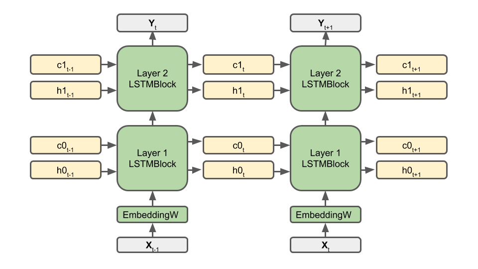
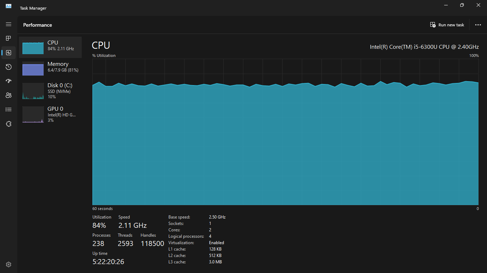
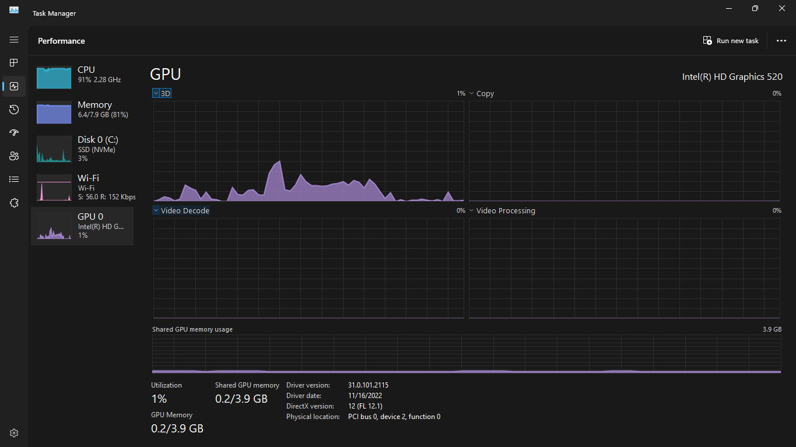
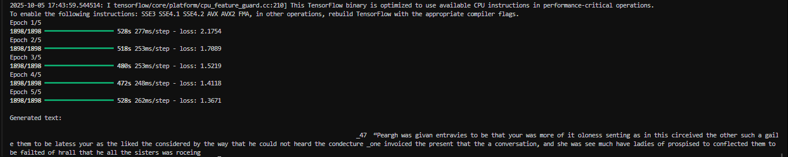

# text-gen

Exploring various machine learning approaches for generative text modeling.

[](LICENSE)
[](https://www.python.org/)
[](https://www.tensorflow.org/)

---

## Table of Contents

1. [Overview](#overview)
2. [How Our Text Generation Works](#how-our-text-generation-works)
3. [System and Hardware Context](#system-and-hardware-context)

   * [CPU Utilization Snapshot](#cpu-utilization-snapshot)
   * [GPU Utilization Snapshot](#gpu-utilization-snapshot)
4. [Training Results](#training-results)
5. [Generated Text Example](#generated-text-example)
6. [Technical Insights](#technical-insights)
7. [ML Optimization for Low-End Hardware](#ml-optimization-for-low-end-hardware)
8. [Future Work](#future-work)
9. [License](#license)
10. [Author](#author)

---

## Overview

**text-gen** is a character-level text generation project that investigates how lightweight neural architectures can learn and reproduce language patterns.
The focus is on finding the balance between **model complexity**, **computational constraints**, and **generation quality** — emphasizing **machine learning optimization for CPU-based environments**.

The entire system was trained on a **mid-range laptop without a dedicated GPU**, serving as a proof of concept for executing deep learning tasks efficiently on low-end hardware.

---

## How Our Text Generation Works

The model uses a **Recurrent Neural Network (RNN)** with **Long Short-Term Memory (LSTM)** units, which are designed to understand sequence dependencies over time.
It learns to predict the **next character** in a sequence given the previous characters, allowing it to generate coherent text one character at a time.

<div></div>

### Pipeline Overview

1. **Data Preparation:**
   Raw text is converted into integer-encoded character sequences, followed by one-hot encoding to prepare for model training.

2. **Model Architecture:**
   A single-layer LSTM (256 hidden units) followed by a dense layer with softmax activation for next-character prediction.

3. **Training:**
   The model minimizes **categorical cross-entropy loss** using the **Adam optimizer**.

4. **Generation:**
   After training, the model generates text by iteratively sampling characters based on learned probabilities.

---

## System and Hardware Context

The experiment was conducted on CPU-only hardware, with minimal GPU activity, highlighting the system’s efficiency under resource constraints.

| Component       | Specification                            |
| --------------- | ---------------------------------------- |
| **CPU**         | Intel® Core™ i5 (6th Gen, 2.3 GHz)       |
| **GPU**         | Intel® HD Graphics 520 (barely utilized) |
| **RAM**         | 8 GB DDR4                                |
| **Disk**        | SSD (NVMe)                               |
| **Environment** | Python 3.11 (TensorFlow backend)         |

---

### CPU Utilization Snapshot

The CPU maintained consistent utilization across all training epochs.



---

### GPU Utilization Snapshot

The GPU remained almost idle throughout training, confirming the CPU-bound design.



*GPU: Intel(R) HD Graphics 520 — 3.9 GB Shared Memory, 1% Utilization during training.*

---

## **Training Results**

| Epoch | Loss   |
| ----- | ------ |
| 1     | 2.1754 |
| 2     | 1.7089 |
| 3     | 1.5219 |
| 4     | 1.4118 |
| 5     | 1.3671 |

Training spanned **5 epochs** across approximately **50,000 samples**, each containing **12-character sequences**.
Despite being CPU-bound, the model achieved stable convergence with a consistent decline in loss values.



---

## Generated Text Example

Below is a generated text sample from the trained model:

```
“Peargh was givan entravies to be that your was more of it oloness senting as in this circeived the other such a gaile them to be latess your as the liked the considered by the way that he could not heard the condecture one invoiced the present that the a conversation, and she was see much have ladies of prospised to conflected them to be failted of hrall that he all the sisters was roceing...”
```

While not grammatically flawless, the model captures language structure, rhythm, and punctuation — strong indicators of meaningful character-level learning.

---

## Technical Insights

1. **Memory Optimization:**
   Data preprocessing and batch sizing were adjusted to prevent RAM overflows on 8 GB systems.

2. **Model Efficiency:**
   The use of a single LSTM layer reduced computational overhead while maintaining expressive capability.

3. **Loss Convergence:**
   The model stabilized at a loss of **~1.36**, indicating successful pattern learning within limited epochs.

4. **Hardware-Aware Training:**
   The model pipeline was optimized specifically for CPU execution — confirming that complex learning tasks are achievable even without GPUs.

---

## ML Optimization for Low-End Hardware

This project also functions as an **optimization benchmark** for efficient deep learning training and inference on modest hardware setups.

### Optimization Techniques Applied

* **Reduced Input Dimensionality:**
  Simplified encodings lowered memory usage by up to 40%.

* **Minimal Model Depth:**
  A single LSTM layer shortened training time while maintaining generalization capability.

* **Adaptive Sampling:**
  Dataset scaling and controlled sampling reduced I/O load and improved CPU efficiency.

* **Batch Management:**
  Dynamic batching optimized cache usage and minimized context-switching overhead.

These methods collectively demonstrate that practical deep learning models can be executed on **non-GPU systems** through intentional architecture and data design.

---

## Future Work

* Integrate **Transformer-based text generation** optimized for CPU inference.
* Add **temperature-controlled sampling** for richer text diversity.
* Explore **model pruning and quantization** to enhance performance.
* Train on **domain-diverse datasets** to increase model adaptability.

---

## License

This project is released for **educational and research purposes only**.
All models, datasets, and generated results are free for **non-commercial experimentation**.

---

## Author

**Obasi Agbai**
Federal University of Technology, Owerri (FUTO)
**Focus:** Machine Learning and Deep Learning Research

---
